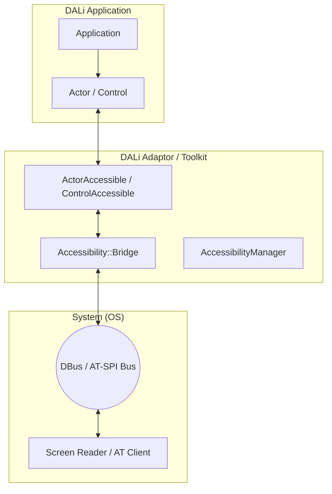
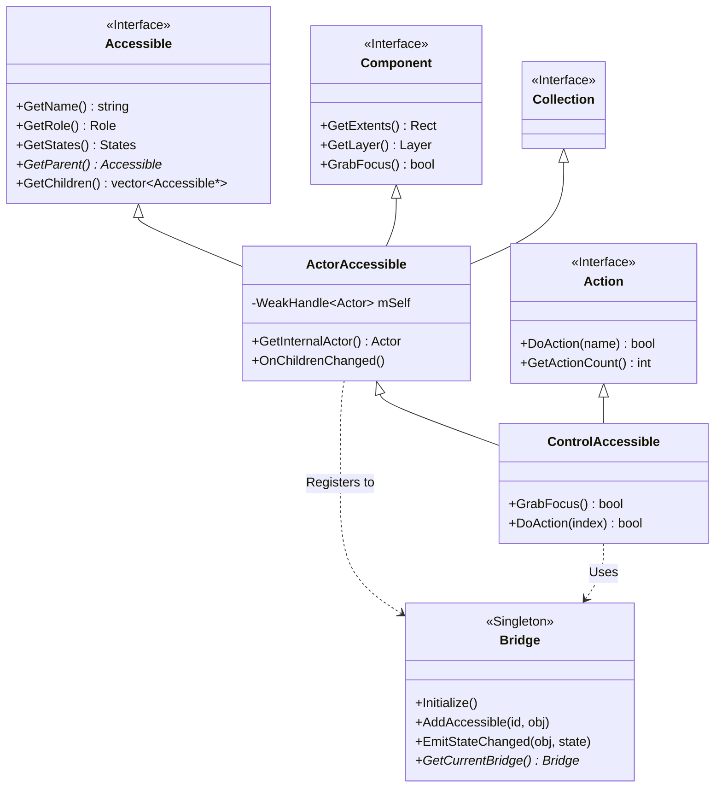
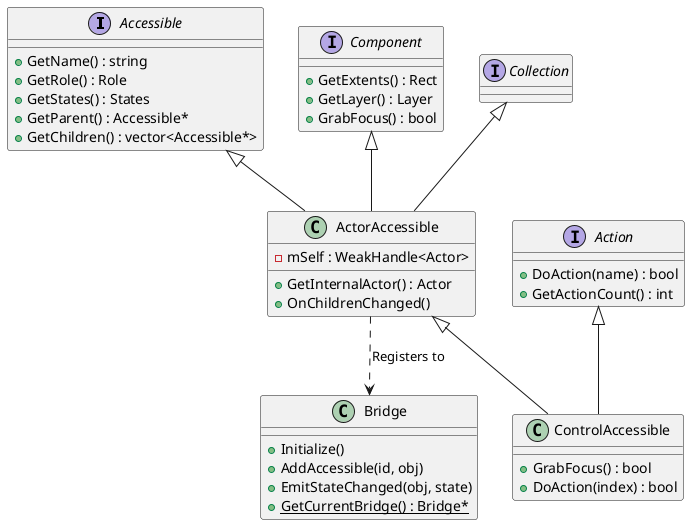
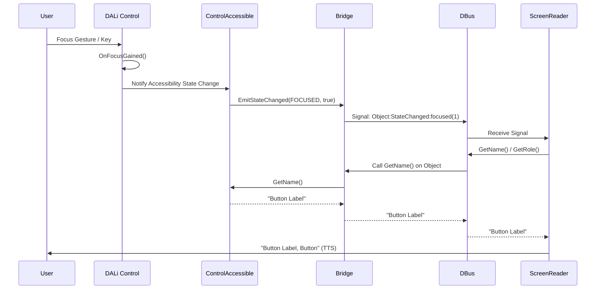
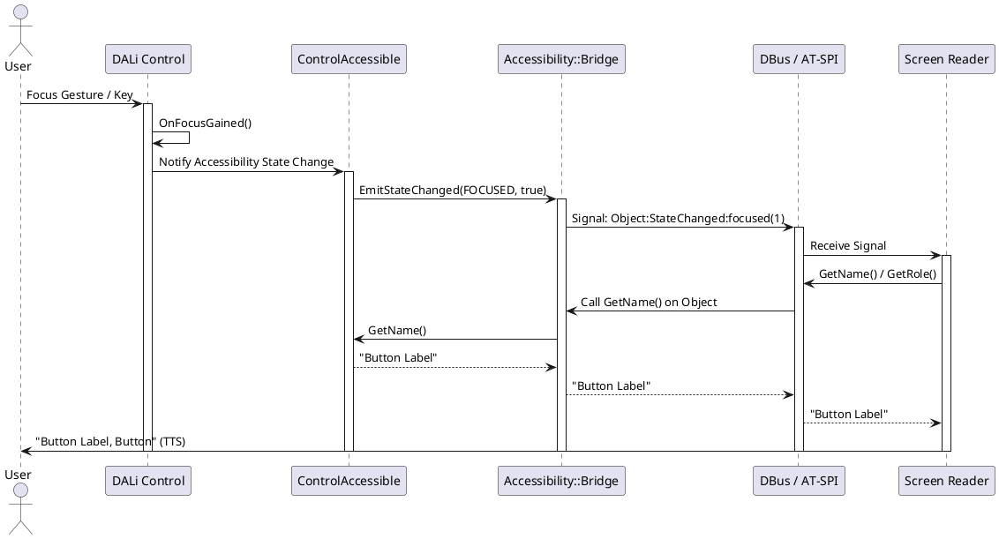

# DALi Accessibility 분석

이 문서는 DALi (Dynamic Animation Library)의 Accessibility(접근성) 프레임워크에 대한 상세한 분석을 다룹니다. 동작 방식, 전체 구조, 클래스 구조 및 관계를 설명하며, 이해를 돕기 위해 다이어그램을 포함합니다.

## 1. 개요 (Overview)

DALi의 Accessibility 프레임워크는 시각 장애인 등을 위한 보조 기술(Assistive Technology, AT) 클라이언트(예: 스크린 리더)와 DALi 애플리케이션 간의 상호작용을 지원합니다. 리눅스 환경의 표준 접근성 인터페이스인 **AT-SPI (Assistive Technology Service Provider Interface)** 를 기반으로 구현되어 있으며, DBus를 통해 외부의 접근성 클라이언트와 통신합니다.

## 2. 동작 방식 (Operation Mechanism)

DALi Accessibility는 다음과 같은 흐름으로 동작합니다:

1.  **객체 매핑 (Object Mapping)**: DALi의 `Actor`나 `Control`은 내부적으로 `Accessible` 객체와 1:1로 매핑됩니다. 이 `Accessible` 객체는 해당 UI 요소의 정보(이름, 역할, 상태, 자식 관계 등)를 접근성 프레임워크에 제공합니다.
2.  **브리지 (Bridge)**: `Bridge` 클래스는 DALi 내부의 `Accessible` 객체들과 외부의 AT-SPI 버스(DBus) 사이를 연결하는 중계자 역할을 합니다.
3.  **이벤트 전달 (Event Emission)**: UI 상태가 변경되면(예: 포커스 이동, 버튼 클릭, 값 변경), `Accessible` 객체는 `Bridge`를 통해 AT-SPI 이벤트를 발생시킵니다.
4.  **명령 수행 (Action Execution)**: 스크린 리더와 같은 외부 클라이언트가 특정 동작(예: 클릭, 스크롤)을 요청하면, DBus를 통해 `Bridge`로 전달되고, 이는 다시 해당 `Accessible` 객체의 메서드(`DoAction`, `DoGesture` 등)를 호출하여 DALi 내부 로직을 수행합니다.

## 3. 전체 구조 (Overall Structure)

전체 구조는 크게 **Application Layer**, **Adaptor/Toolkit Layer**, **System Layer**로 나눌 수 있습니다.

*   **Application Layer**: 사용자가 작성한 DALi 애플리케이션. `Actor`와 `Control`을 생성하고 배치합니다.
*   **Adaptor/Toolkit Layer**: Accessibility의 핵심 로직이 존재하는 곳입니다.
    *   `Accessible`: 모든 접근성 객체의 기본 인터페이스.
    *   `ActorAccessible`: `Actor`와 연결된 접근성 객체.
    *   `ControlAccessible`: `Control`과 연결된 접근성 객체로, `Action` 인터페이스 등을 추가로 구현합니다.
    *   `Bridge`: AT-SPI 버스와의 통신을 담당하는 싱글톤 객체.
*   **System Layer**: OS 레벨의 접근성 인프라.
    *   **AT-SPI Registry**: 접근성 애플리케이션들을 관리.
    *   **DBus**: 프로세스 간 통신(IPC) 채널.
    *   **Screen Reader**: 최종 사용자에게 정보를 전달하는 클라이언트 (예: Orca, VoiceOver 등).

### Architecture Diagram (Mermaid)

## 4. 클래스 구조 및 관계 (Class Structure & Relationships)

DALi Accessibility의 클래스 구조는 상속과 인터페이스 구현을 통해 계층적으로 구성되어 있습니다.

### 주요 클래스 (Key Classes)

1.  **`Dali::Accessibility::Accessible`**
    *   **정의**: 모든 접근성 객체의 최상위 추상 기본 클래스(Interface)입니다.
    *   **역할**: 접근성 객체가 갖춰야 할 필수 메서드(`GetName`, `GetRole`, `GetStates`, `GetChildren` 등)를 정의합니다.
    *   **위치**: `dali-adaptor/dali/devel-api/atspi-interfaces/accessible.h`

2.  **`Dali::Accessibility::ActorAccessible`**
    *   **상속**: `Accessible`, `Collection`, `Component`, `ConnectionTracker`, `BaseObjectObserver`
    *   **정의**: DALi의 `Actor`와 연결되는 접근성 객체입니다.
    *   **역할**:
        *   `Actor`의 생명주기를 관찰(`BaseObjectObserver`)하며, `Actor`가 파괴되면 자신도 정리합니다.
        *   `Actor`의 계층 구조를 `Accessible`의 트리 구조로 매핑합니다 (`GetChildren` 구현).
        *   기본적인 화면 좌표(`GetExtents`)와 레이어 정보 등을 제공합니다.
    *   **위치**: `dali-adaptor/dali/devel-api/adaptor-framework/actor-accessible.h`

3.  **`Dali::Toolkit::DevelControl::ControlAccessible`**
    *   **상속**: `ActorAccessible`, `Action` (Virtual inheritance)
    *   **정의**: DALi Toolkit의 `Control`을 위한 접근성 객체입니다.
    *   **역할**:
        *   `Control` 특화 기능(예: `GrabFocus`, `DoAction`)을 구현합니다.
        *   `Action` 인터페이스를 통해 "클릭" 등의 동작을 외부에서 수행할 수 있게 합니다.
        *   하이라이트(Highlight) 처리를 담당합니다.
    *   **위치**: `dali-toolkit/dali-toolkit/devel-api/controls/control-accessible.h`

4.  **`Dali::Accessibility::Bridge`**
    *   **정의**: AT-SPI 버스와 통신을 관리하는 싱글톤 클래스입니다.
    *   **역할**:
        *   `Accessible` 객체 등록 및 해제 관리.
        *   DBus를 통한 이벤트 송수신.
        *   애플리케이션의 루트 객체 관리.
    *   **위치**: `dali-adaptor/dali/devel-api/adaptor-framework/accessibility-bridge.h`

### Class Diagram (Mermaid)

### Class Diagram (PlantUML)

## 5. 상세 관계 및 상호작용 (Detailed Relationships & Interactions)

### Actor와 Accessible의 관계
*   `Actor`는 `Accessible` 객체를 직접 소유하지 않지만, 필요할 때 `Accessible::Get(actor)`를 통해 연관된 `Accessible` 객체를 가져올 수 있습니다.
*   `ActorAccessible`은 `Actor`에 대한 `WeakHandle`을 가지고 있어, `Actor`가 유효한 동안만 접근성 기능을 제공합니다.
*   `Actor`의 계층 구조(Parent-Child)는 `ActorAccessible::GetChildren()`을 통해 접근성 트리에 반영됩니다. 기본적으로 `Actor`의 자식들이 접근성 자식이 되지만, `DoGetChildren`을 오버라이딩하여 이를 커스터마이징할 수 있습니다.

### Bridge와 Accessible의 관계
*   `Accessible` 객체가 생성되거나 초기화될 때, `Bridge::AddAccessible`을 통해 브리지에 등록됩니다. 이때 고유한 ID(주로 Actor ID)가 사용됩니다.
*   외부(AT-SPI)에서 특정 객체에 대한 요청이 오면, `Bridge`는 등록된 맵에서 해당 ID의 `Accessible` 객체를 찾아 요청을 위임합니다.

### Sequence Diagram: 포커스 이동 시나리오 (Mermaid)

사용자가 키보드나 제스처로 포커스를 이동했을 때의 흐름입니다.

### Sequence Diagram: 포커스 이동 시나리오 (PlantUML)

## 6. 결론 (Conclusion)

DALi의 Accessibility 프레임워크는 `Accessible` 인터페이스를 중심으로 `Actor`와 `Control`을 래핑하여, 내부 UI 구조를 표준 AT-SPI 인터페이스로 노출시키는 구조를 가지고 있습니다. `Bridge`는 이들 객체와 외부 시스템 간의 통신을 담당하는 핵심 허브 역할을 수행합니다. 이러한 구조를 통해 DALi 애플리케이션은 별도의 복잡한 설정 없이도 리눅스 데스크탑 환경의 접근성 도구들과 호환될 수 있습니다.
