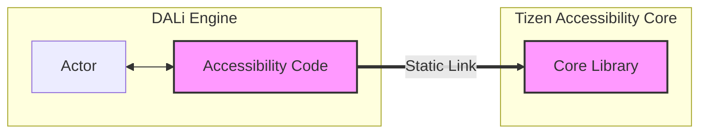

# DALi Accessibility: 직접 연결(Direct) vs Bridge 어댑터 비교 분석

이 문서는 DALi Accessibility 아키텍처 리팩토링 시 고려된 두 가지 주요 연결 방식인 **"직접 연결 (Direct Connection)"**과 **"Bridge 어댑터 (Bridge Adapter)"** 방식을 심층 비교 분석합니다.

결론적으로, DALi의 **경량화(Lightweighting)**와 **순수성(Purity)** 유지를 위해 **Bridge 어댑터 방식**이 더 우수한 선택임을 설명합니다.

## 1. 개요

*   **직접 연결 (Direct Connection)**: DALi 엔진이 접근성 코어 라이브러리(`Tizen Accessibility Core`)를 직접 참조하고 호출하는 방식.
*   **Bridge 어댑터 (Bridge Adapter)**: DALi 엔진은 접근성 코어에 대해 모르며, 중간에 얇은 어댑터(Bridge)를 두어 런타임에 동적으로 연결하는 방식.

## 2. 상세 비교 분석

| 비교 항목 | 직접 연결 (Direct Connection) | Bridge 어댑터 (Bridge Adapter) |
| :--- | :--- | :--- |
| **의존성 (Dependency)** | **강한 결합 (Tight Coupling)**<br>DALi 빌드 시 Core 라이브러리 필수. | **느슨한 결합 (Loose Coupling)**<br>DALi는 Core 존재를 모름. 런타임 플러그인. |
| **메모리 (Memory)** | **항상 로드됨 (Static Load)**<br>접근성 미사용 시에도 라이브러리가 메모리에 상주. | **필요 시 로드됨 (On-Demand Load)**<br>접근성 활성화 시점에만 `dlopen`으로 로드. |
| **코드 순수성 (Purity)** | **낮음 (Low)**<br>DALi 헤더에 접근성 관련 타입(`IAccessibleNode` 등)이 포함됨. | **높음 (High)**<br>DALi 코드는 렌더링 로직만 유지. 접근성 코드는 Bridge에 격리. |
| **초기화 비용 (Startup)** | **높음 (High)**<br>앱 실행 시 접근성 라이브러리도 함께 초기화. | **낮음 (Low)**<br>앱 실행 시에는 영향 없음. |
| **유지보수 (Maintenance)** | Core 변경 시 DALi 재빌드 필요. | Bridge만 재빌드하면 됨. DALi 영향 없음. |
| **확장성 (Extensibility)** | Tizen 외 플랫폼 지원 시 코드 수정 필요. | 플랫폼별 Bridge만 교체하면 됨 (예: Android Bridge). |

## 3. 심층 분석: 왜 Bridge 어댑터인가?

### 3.1. DALi의 "순수성(Purity)" 보장
DALi는 고성능 UI 렌더링 엔진입니다. 본질적인 역할은 화면을 그리고 애니메이션을 처리하는 것입니다.
*   **Direct 방식**: `Actor` 클래스 내부에 `GetAccessibilityNode()` 같은 메서드가 생기고, `IAccessibleNode` 타입을 알기 위해 헤더를 include 해야 합니다. 이는 렌더링 엔진이 접근성 도메인에 오염되는 결과를 낳습니다.
*   **Bridge 방식**: DALi는 접근성에 대해 아무것도 모릅니다. 대신 Bridge가 "DALi의 상태를 관찰(Inspect)"하여 접근성 정보를 만들어냅니다. DALi 코드는 깨끗하게 유지됩니다.

### 3.2. "경량화(Lightweighting)"의 핵심: On-Demand Loading
임베디드 환경이나 저사양 기기에서는 메모리 1MB, 부팅 시간 10ms가 중요합니다.
*   **Direct 방식**: 사용자가 접근성 기능을 켜지 않아도, 바이너리가 링크되어 있으므로 OS 로더가 앱 실행 시점에 접근성 라이브러리를 메모리에 올립니다. 불필요한 비용입니다.
*   **Bridge 방식**: 앱은 가볍게 시작합니다. 사용자가 접근성 기능을 켜는 순간(Runtime), DALi는 설정된 플러그인(Bridge)을 동적으로 로드합니다. **쓰지 않는 기능에 비용을 지불하지 않는(Zero-cost abstraction)** 원칙을 지킬 수 있습니다.

### 3.3. "방화벽(Firewall)" 역할
Bridge는 DALi를 외부의 변화로부터 보호합니다.
*   `Tizen Accessibility Core`의 내부 구현이 바뀌거나, AT-SPI 버전이 업그레이드되어도 DALi 엔진 자체는 안전합니다. 오직 얇은 Bridge 계층만 수정하고 다시 빌드하면 됩니다. 이는 거대한 엔진을 유지보수하는 입장에서 빌드 시간과 테스트 비용을 획기적으로 줄여줍니다.

## 4. 다이어그램 비교

### Direct Connection (비추천)


*   DALi 내부에 접근성 코드가 혼재되어 있고, Core 라이브러리와 강하게 묶여 있습니다.

### Bridge Adapter (추천)

```mermaid
graph LR
    subgraph "DALi Engine"
        Actor[Actor]
    end
    subgraph "Bridge Plugin"
        Adapter[Bridge Adapter]
    end
    subgraph "Tizen Accessibility Core"
        Lib[Core Library]
    end
    
    Actor -.-> Adapter : Runtime Inspection
    Adapter == Dynamic Link ==> Lib
    
    style Adapter fill:#bbf,stroke:#333,stroke-width:2px
    style Lib fill:#bbf,stroke:#333,stroke-width:2px
```
*   DALi는 독립적이며, Bridge가 중간에서 런타임에 연결해줍니다.

## 5. 결론

DALi가 지향하는 **고성능, 경량화, 모듈화** 목표를 달성하기 위해서는 **Bridge 어댑터 패턴**이 필수적입니다. 이는 단순히 코드를 분리하는 것을 넘어, DALi를 플랫폼 종속성으로부터 해방시키고 본연의 렌더링 기능에 집중하게 만드는 아키텍처적 결단입니다.
