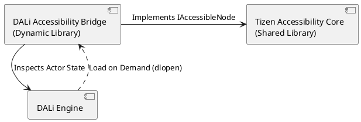
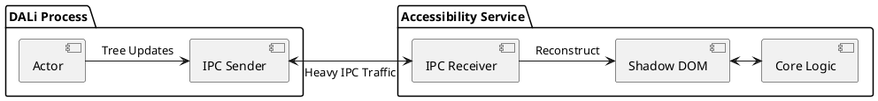
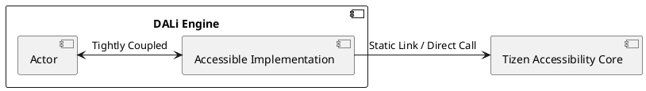
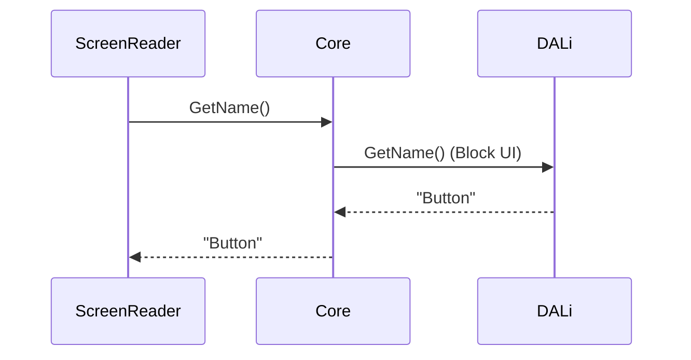
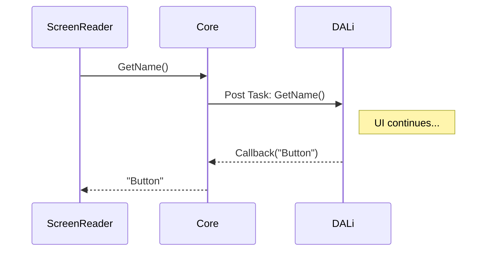
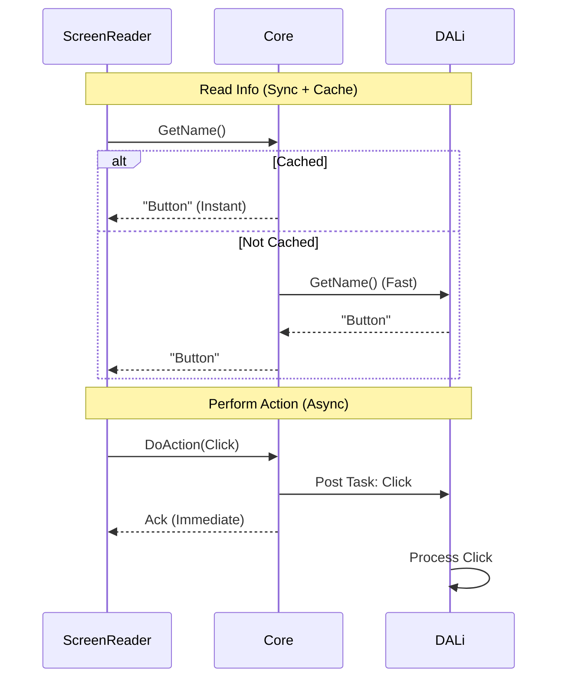
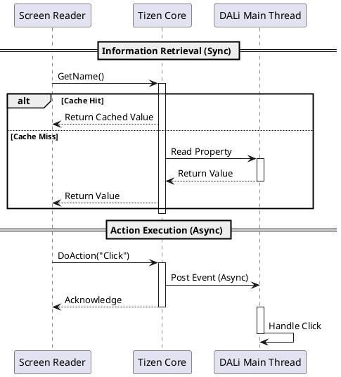

# DALi 경량화 및 Tizen 접근성 통합을 위한 아키텍처 개선 제안

이 문서는 DALi (Dynamic Animation Library)의 **경량화(Lightweighting) 및 효율화(Efficiency)**를 달성하고, 동시에 Tizen 생태계의 접근성 파편화 문제를 해결하기 위한 아키텍처 개선 제안서입니다.

## 1. 배경 및 목적 (Background & Objectives)

### 1.1. DALi의 비대화 문제 (The Bloat Problem)
현재 DALi의 Accessibility 구현체(`ActorAccessible`, `ControlAccessible`)는 `Actor` 및 `Control`과 강하게 결합되어 있습니다.
*   **메모리 낭비**: 접근성 기능이 필요 없는 환경(예: 저사양 기기, 접근성 미사용 사용자)에서도 관련 객체 생성 및 초기화 로직이 수행되거나, 최소한의 메모리 공간을 점유합니다.
*   **초기화 비용**: 앱 구동 시점에 Accessibility Bridge 및 관련 리소스를 준비하는 과정이 DALi 코어 초기화 단계에 포함되어 있어, 부팅 속도(Startup Time)에 영향을 줍니다.
*   **바이너리 크기**: Accessibility 관련 코드가 DALi Core/Toolkit 라이브러리에 포함되어 있어, 전체 바이너리 크기를 증가시킵니다.

### 1.2. Tizen 생태계의 확장 (Ecosystem Expansion)
Tizen은 이제 DALi뿐만 아니라 Web, Flutter 등 다양한 UI Toolkit을 지원합니다. 현재 DALi에 종속된 Accessibility 구조는 다른 Toolkit에서 재사용할 수 없으며, 이는 플랫폼 전체의 비효율을 초래합니다.

**따라서, 본 제안의 핵심 목표는 "Accessibility를 DALi에서 분리하여 DALi를 가볍게 만들고, 분리된 모듈을 공용화하는 것"입니다.**

## 2. 아키텍처 옵션 비교 (Architectural Options Comparison)

Accessibility 모듈을 DALi에서 분리하는 방식에 대해 3가지 옵션을 비교 분석합니다.

### Option A: Bridge Adapter (추천)
DALi와 Core 사이에 얇은 어댑터(Bridge)를 두고, 이를 런타임에 동적으로 로드하는 방식입니다.

*   **구조**: `DALi` <-> `Bridge (Plugin)` <-> `Tizen Accessibility Core`
*   **장점**:
    *   **경량화 최적**: 접근성 미사용 시 DALi에 오버헤드가 거의 없음 (Zero-cost abstraction).
    *   **유연성**: DALi 코드를 수정하지 않고도 접근성 구현체를 교체 가능.
*   **단점**: 플러그인 로딩 구조 설계가 필요함.

#### Diagram (Mermaid)
```mermaid
graph LR
    subgraph DALi
        Actor[Actor / Control]
    end
    subgraph "Bridge (Dynamic Lib)"
        Adapter[DALi Accessibility Adapter]
    end
    subgraph "Tizen Accessibility Core"
        Core[Core Logic]
    end
    Actor -.-> Adapter : Inspects (Runtime)
    Adapter <--> Core : Implements Interface
```

#### Diagram (PlantUML)


### Option B: External Service Delegation
접근성 로직을 별도의 프로세스(Service)로 완전히 분리하고 IPC로 통신하는 방식입니다.

*   **구조**: `DALi Process` <-> `IPC` <-> `Accessibility Service Process`
*   **장점**: 완벽한 프로세스 격리. DALi 크래시가 접근성에 영향을 주지 않음.
*   **단점**:
    *   **성능 저하**: UI 트리가 변할 때마다 방대한 데이터를 IPC로 전송해야 함 (Serialization 비용).
    *   **동기화 문제**: 화면은 갱신되었는데 접근성 트리는 갱신되지 않는 타이밍 이슈 발생 가능.

#### Diagram (Mermaid)
```mermaid
graph LR
    subgraph "DALi Process"
        Actor[Actor]
        IPC_Client[IPC Client]
    end
    subgraph "Accessibility Service Process"
        IPC_Server[IPC Server]
        Mirror[Mirror Tree]
        Core[Core Logic]
    end
    Actor --> IPC_Client : Serialize Tree
    IPC_Client <--> IPC_Server : IPC (Socket/Pipe)
    IPC_Server --> Mirror : Update
    Mirror <--> Core
```

#### Diagram (PlantUML)


### Option C: Direct Connection
DALi가 `Tizen Accessibility Core` 라이브러리를 직접 링크(Link)하여 사용하는 방식입니다.

*   **구조**: `DALi` <-> `Tizen Accessibility Core`
*   **장점**: 구현이 가장 단순함. 호출 오버헤드가 가장 적음.
*   **단점**:
    *   **강한 결합**: DALi 빌드 시 Core 라이브러리가 필수.
    *   **메모리 낭비**: 접근성 미사용 시에도 라이브러리가 로드됨. DALi 코드 내에 접근성 타입이 혼재됨.

#### Diagram (Mermaid)
```mermaid
graph LR
    subgraph "DALi Binary"
        Actor[Actor]
        Impl[Accessible Impl]
    end
    subgraph "Tizen Accessibility Core"
        Core[Core Logic]
    end
    Actor <--> Impl
    Impl <--> Core : Direct Function Call
```

#### Diagram (PlantUML)


---

## 3. 통신 모델 비교 (Communication Model Comparison)

UI 스레드와 접근성 로직(DBus 통신) 간의 상호작용 방식에 대한 3가지 옵션입니다.

### Model 1: Fully Synchronous (동기식)
모든 요청(정보 조회, 액션 수행)을 UI 스레드에서 동기적으로 처리합니다.

*   **장점**: 구현 단순, 데이터 정합성(Consistency) 완벽 보장.
*   **단점**: DBus 통신이 지연되면 UI 프레임 드랍(Jank) 발생.

#### Diagram (Mermaid)


### Model 2: Fully Asynchronous (비동기식)
모든 요청을 별도 스레드나 작업 큐를 통해 비동기로 처리합니다.

*   **장점**: UI 스레드 블로킹 절대 없음.
*   **단점**:
    *   **복잡성**: 콜백 지옥, 레이스 컨디션 관리 필요.
    *   **사용자 경험 저하**: 스크린 리더가 "현재 포커스"를 물었는데, 응답이 오기 전에 포커스가 이미 이동해버릴 수 있음 (Stale Data).

#### Diagram (Mermaid)


### Model 3: Hybrid (혼합형) - **추천**
정보 조회(Getters)는 **Sync (with Caching)**, 액션/이벤트(Actions)는 **Async**로 처리합니다.

*   **장점**:
    *   **반응성**: `GetName` 등은 즉시 응답하여 스크린 리더의 답답함 해소.
    *   **성능**: 무거운 작업(이벤트 전파, 액션 수행)은 UI를 방해하지 않음.
    *   **캐싱 전략**: Sync 조회 시 DBus 타임아웃을 방지하기 위해 Core 레벨에서 적극적인 캐싱 사용.

#### Diagram (Mermaid)


#### Diagram (PlantUML)


## 4. 최종 제안 (Final Recommendation)

**Option A (Bridge Adapter)** 구조와 **Model 3 (Hybrid Communication)** 모델을 결합하는 것을 최종 제안합니다.

이 조합은 **DALi의 경량화**라는 최우선 목표를 달성하면서도, **사용자 경험(반응성)**을 해치지 않는 최적의 균형점입니다.
