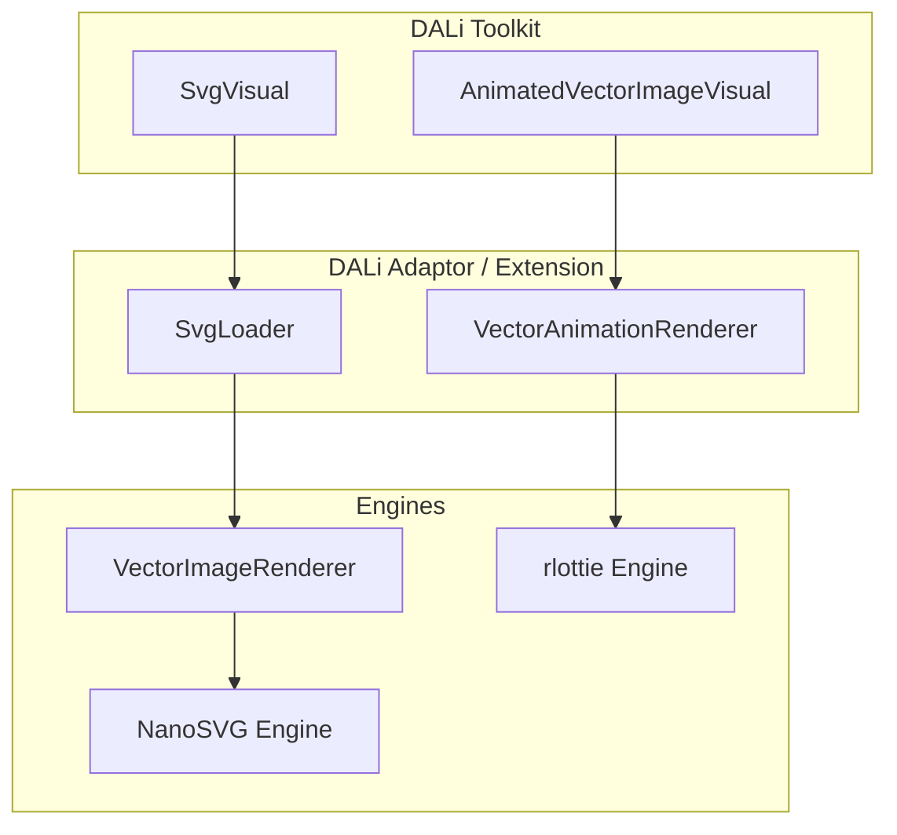
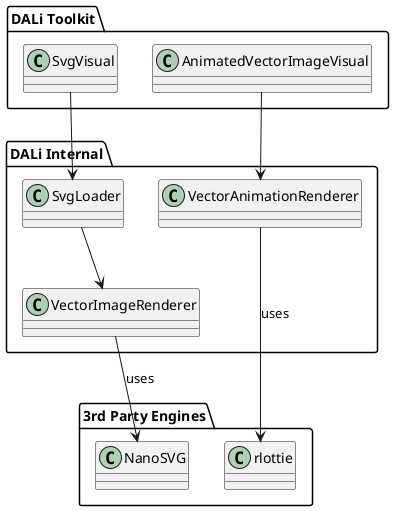
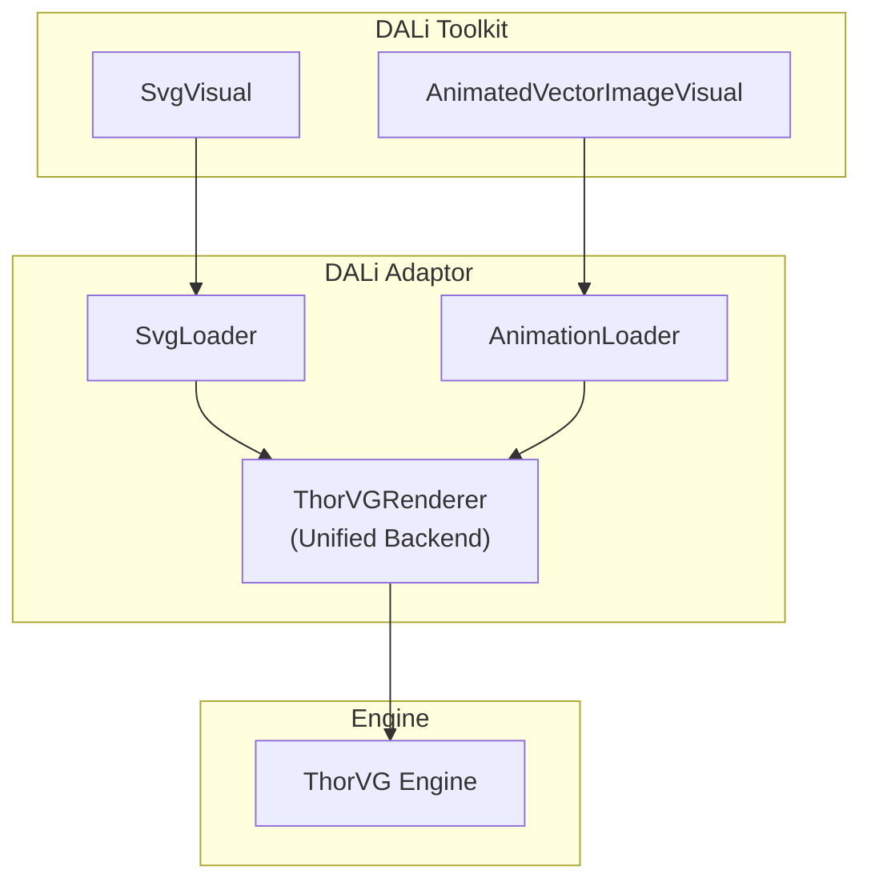
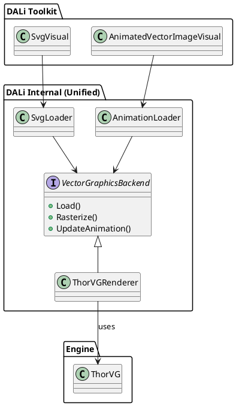

# DALi ThorVG 통합 아키텍처 설계 제안서

## 1. 배경 및 목적 (Background & Objective)

### 1.1 현황 (Current Status)
현재 DALi는 벡터 그래픽 처리를 위해 두 개의 서로 다른 엔진을 사용하고 있습니다.
*   **SVG (Static Vector Graphics)**: `NanoSVG`를 기반으로 한 `VectorImageRenderer` 사용 (일부 ThorVG 코드가 포함되어 있으나 비활성화/혼재됨).
*   **Lottie (Animated Vector Graphics)**: `rlottie` 라이브러리를 직접 사용하는 `VectorAnimationRenderer` 사용.

### 1.2 문제점 (Issues)
1.  **엔진 중복 (Redundancy)**: 유사한 벡터 그래픽 처리를 위해 두 개의 무거운 엔진을 유지보수해야 함.
2.  **성능 및 품질 (Performance & Quality)**: `NanoSVG`와 `rlottie`는 구형 엔진으로, 최신 벡터 그래픽 기능 지원이나 렌더링 품질, 성능 면에서 최적화가 부족할 수 있음.
3.  **바이너리 사이즈 (Binary Size)**: 두 개의 별도 라이브러리를 링크함에 따라 앱/프레임워크의 용량이 불필요하게 증가함.
4.  **유지보수 복잡성 (Maintenance)**: 서로 다른 API와 동작 방식을 가진 두 엔진을 각각 관리해야 하는 부담이 있음.

### 1.3 목적 (Objective)
최신 경량 벡터 그래픽 엔진인 **ThorVG**를 도입하여 SVG와 Lottie 처리를 단일 엔진으로 통합합니다. 이를 통해 **경량화(Lightweighting)**, **효율화(Efficiency)**, **품질 향상(Quality Improvement)**을 달성하고, DALi의 아키텍처를 단순화합니다.

---

## 2. 아키텍처 분석 (Architecture Analysis)

### 2.1 AS-IS 아키텍처 (Current Architecture)
현재 구조는 `Toolkit` 레벨의 Visual들이 서로 다른 경로를 통해 하위 엔진에 접근합니다.

#### Diagram (Mermaid)


#### Diagram (PlantUML)


### 2.2 TO-BE 아키텍처 (Proposed Architecture)
ThorVG를 공통 백엔드로 사용하는 통합 구조입니다.

#### Diagram (Mermaid)


#### Diagram (PlantUML)


---

## 3. 설계 결정 옵션 비교 (Design Options & Decision)

ThorVG 통합을 위한 3가지 설계 옵션을 비교 분석합니다.

### Option 1: 개별 엔진 교체 (Component Replacement)
기존 클래스 구조를 그대로 유지하되, 내부 구현만 ThorVG로 각각 교체하는 방식입니다.
*   **`VectorImageRenderer` 내부**: NanoSVG -> ThorVG
*   **`VectorAnimationRenderer` 내부**: rlottie -> ThorVG

| 항목 | 내용 |
| :--- | :--- |
| **장점** | 기존 코드 구조 변경 최소화, 리스크 낮음. |
| **단점** | 코드 중복(ThorVG 초기화/관리 코드) 발생, 구조적 통합 효과 미미. |
| **평가** | 단기적인 해결책이나, 아키텍처 관점에서는 비효율적임. |

### Option 2: 통합 백엔드 어댑터 (Unified Backend Adapter) - **[Recommended]**
SVG와 Lottie를 모두 처리할 수 있는 통합된 `VectorGraphicsBackend` (또는 개선된 `VectorImageRenderer`)를 설계하고, 상위 Visual들이 이를 공유하는 방식입니다.

| 항목 | 내용 |
| :--- | :--- |
| **장점** | 엔진 초기화/리소스 관리 일원화, 코드 재사용성 극대화, 유지보수 용이. |
| **단점** | `dali-extension`에 있는 Lottie 로직을 `dali-adaptor`나 공통 영역으로 이동/통합하는 리팩토링 비용 발생. |
| **평가** | **가장 권장되는 방식.** DALi의 경량화 및 효율화 목표에 부합함. |

### Option 3: 신규 Visual 도입 (New Visual Type)
기존 Visual을 유지하고, ThorVG 전용의 새로운 `ThorVgVisual`을 만드는 방식입니다.

| 항목 | 내용 |
| :--- | :--- |
| **장점** | 기존 하위 호환성 완벽 보장. |
| **단점** | API 파편화, 사용자의 마이그레이션 부담, 기존 Visual은 여전히 구형 엔진 사용. |
| **평가** | 기존 Visual의 성능 향상을 목표로 하는 현재 요구사항에 맞지 않음. |

---

## 4. 상세 설계 (Detailed Design - Option 2)

### 4.1 데이터 구조 및 클래스 설계 (Data Structures)

#### `ThorVGRenderer` (New/Refactored Class)
기존 `VectorImageRenderer`를 확장하거나 대체합니다.
*   **역할**: ThorVG 인스턴스(`tvg::Canvas`) 관리, 리소스 로딩, 래스터라이즈 실행.
*   **주요 멤버**:
    *   `std::unique_ptr<tvg::SwCanvas> mCanvas`: 소프트웨어 래스터라이저 캔버스.
    *   `std::unique_ptr<tvg::Picture> mPicture`: SVG/Lottie 정적 데이터.
    *   `std::unique_ptr<tvg::Animation> mAnimation`: Lottie 애니메이션 제어 객체.

```cpp
class ThorVGRenderer : public VectorGraphicsBackend {
public:
    bool Load(const std::string& url); // SVG & Lottie 공용
    bool Load(const Vector<uint8_t>& data);
    
    // For Static (SVG)
    PixelBuffer Rasterize(uint32_t width, uint32_t height);
    
    // For Animation (Lottie)
    bool UpdateFrame(float frameNo);
    float GetTotalFrame() const;
    
private:
    std::unique_ptr<tvg::SwCanvas> mCanvas;
    std::unique_ptr<tvg::Animation> mAnimation; // For Lottie
    std::unique_ptr<tvg::Picture> mPicture;     // For SVG
};
```

### 4.2 스레딩 모델 (Threading Model)
*   **Rasterization**: ThorVG의 SW Rasterizer는 CPU 연산을 수행하므로, UI 스레드 블로킹을 방지하기 위해 `AsyncTaskManager`를 통한 워커 스레드에서 실행되어야 합니다.
*   **Thread Safety**: `tvg::Canvas`는 스레드 간 공유되지 않도록 인스턴스별로 관리하거나, 락(Lock)을 통해 보호해야 합니다. 현재 DALi의 `SvgTask` 구조를 활용하여 비동기 처리를 유지합니다.

### 4.3 마이그레이션 단계 (Migration Steps)
1.  **Phase 1 (SVG)**: `dali-adaptor`의 `VectorImageRenderer`에서 `THORVG_SUPPORT` 플래그를 기본값으로 활성화하고, `NanoSVG` 의존성을 제거합니다.
2.  **Phase 2 (Lottie)**: `dali-extension`의 `VectorAnimationRenderer`를 리팩토링하여 `rlottie` 대신 `ThorVGRenderer`(또는 ThorVG API)를 사용하도록 변경합니다.
3.  **Phase 3 (Unification)**: 두 Renderer의 공통 로직을 추출하여 단일 백엔드 클래스로 통합합니다.

---

## 5. 결론 (Conclusion)
ThorVG 도입은 DALi의 벡터 그래픽 품질과 성능을 한 단계 끌어올릴 수 있는 중요한 전환점입니다. **Option 2 (통합 백엔드 어댑터)** 방식을 통해 아키텍처를 단순화하고 바이너리 사이즈를 절감하는 것이 가장 효율적입니다. 이를 통해 SVG와 Lottie 모두에서 일관된 렌더링 품질과 향상된 퍼포먼스를 제공할 수 있습니다.
