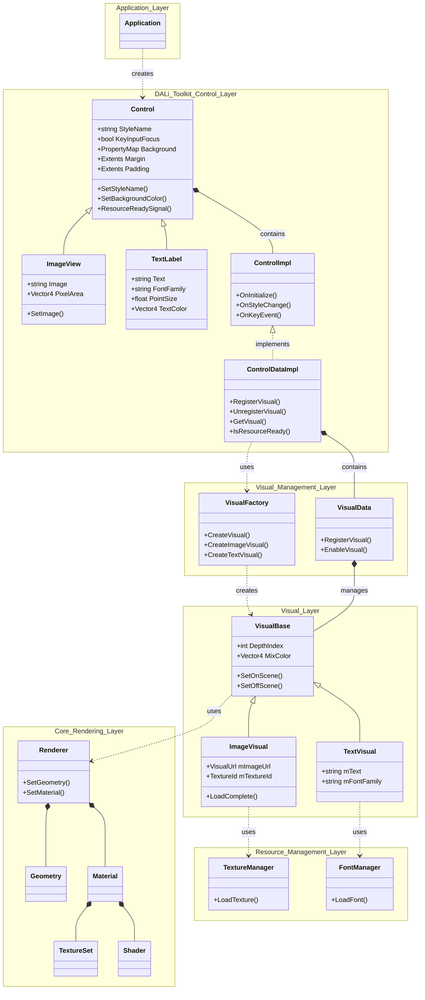
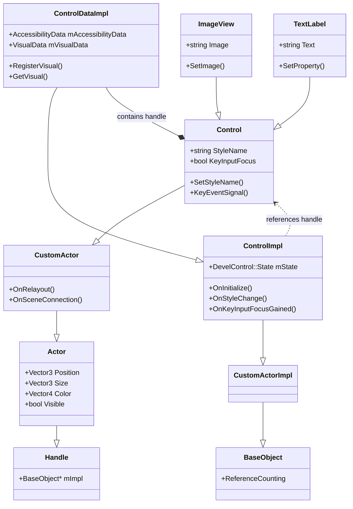
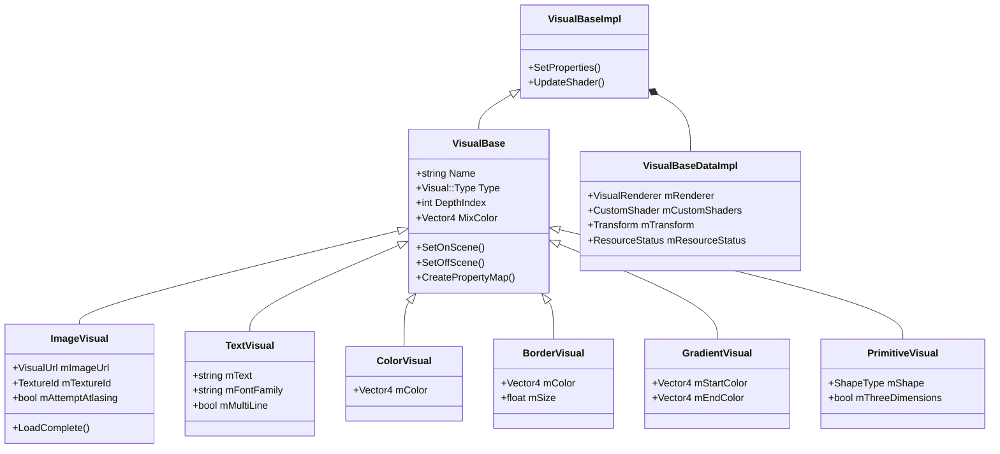
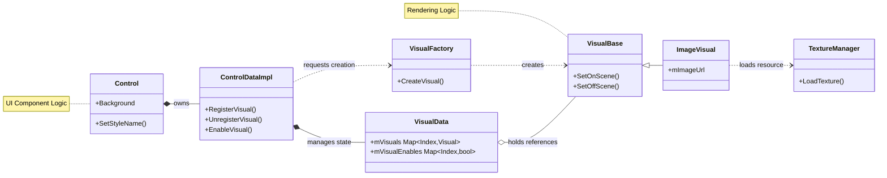

# DALi Control 및 Visual 아키텍처
## 🚀 고성능 UI/UX 구현을 위한 통합 기술 보고서

---

## 1. 서론: 임베디드 UI 프레임워크의 진화와 DALi의 철학

현대의 사용자 인터페이스(UI) 환경, 특히 모바일 및 임베디드 시스템에서의 UI 개발은 **극한의 성능 효율성**과 **유연한 디자인 확장성**이라는 두 가지 상충되는 요구사항을 동시에 만족시켜야 하는 과제에 직면해 있습니다. 제한된 하드웨어 리소스(CPU, GPU, 메모리) 내에서 부드러운 60fps 이상의 렌더링을 보장하면서도, 복잡하고 화려한 애니메이션과 상호작용을 지원해야 하기 때문입니다.

삼성전자의 타이젠(Tizen) 플랫폼을 비롯한 다양한 임베디드 환경에서 사용되는 **DALi(Dynamic Animation Library)**는 이러한 문제를 해결하기 위해 다음과 같은 핵심 철학을 바탕으로 설계되었습니다.

> **"논리(Logic)와 표현(Presentation)의 분리"**

본 보고서는 DALi 프레임워크의 핵심인 **Control(컨트롤)**과 **Visual(비주얼)** 아키텍처를 심층적으로 분석합니다. 이 두 축이 어떻게 독립적으로 기능하면서도 유기적으로 결합하여 고성능 UI를 구현하는지 기술하며, 객체 지향 설계 원칙(SOLID)이 실제 시스템 구현에 어떻게 반영되었는지 확인합니다.

### 1.1 아키텍처 설계의 핵심 원칙

* **관심사의 분리 (Separation of Concerns):** UI 컴포넌트의 역할은 사용자의 입력을 처리하고 상태를 관리하는 **'논리적 제어(Control)'**와 상태를 화면에 픽셀로 그려내는 **'시각적 렌더링(Visual)'**으로 명확히 구분됩니다.
* **단일 책임 원칙 (SRP):** 각 클래스는 하나의 명확한 책임만을 가집니다.
    * `ControlDataImpl`: 데이터 관리
    * `VisualFactory`: 객체 생성 전담
* **개방-폐쇄 원칙 (OCP):** `CustomActor`나 `VisualBase`와 같은 확장 포인트를 제공하여, 기존 코드를 수정하지 않고도 새로운 기능을 추가할 수 있습니다.
* **의존성 역전 원칙 (DIP):** 상위 모듈이 하위 모듈의 구현 세부 사항에 의존하지 않도록 추상화된 인터페이스(Handle)를 통해 통신합니다.

---

## 2. DALi 전체 아키텍처 조망

DALi 시스템은 하드웨어 추상화 계층 위에서 애플리케이션 로직까지 이어지는 **다층적(Layered)** 구조를 가지고 있습니다.

### 2.1 전체 아키텍처 다이어그램

### 2.2 계층별 역할 및 구성 요소

* **Application Layer:** `Application` 클래스는 프로그램의 진입점으로, 툴킷 계층의 Control 객체들을 생성하고 씬(Scene)에 배치합니다.
* **DALi Toolkit Layer:**
    * **Control Layer:** 버튼, 이미지 뷰 등 실제 UI 컴포넌트의 로직(`Control`, `ImageView`)이 위치합니다.
    * **Visual Management Layer:** `VisualFactory`를 통해 Visual 객체를 생성하고, `VisualData`를 통해 관리합니다.
    * **Visual Layer:** `ImageVisual`, `TextVisual` 등 실제 렌더링 로직을 담은 클래스들이 존재합니다.
* **DALi Core Layer:** 씬 그래프의 노드인 Actor와 GPU 통신을 담당하는 `Renderer`가 정의됩니다.
* **Resource Management Layer:** `TextureManager`, `FontManager` 등이 메모리와 성능 최적화를 위해 리소스를 관리합니다.

### 2.3 데이터 흐름

데이터는 **App → Control → Visual → Core/Resource** 방향으로 흐릅니다.

1.  애플리케이션이 `Control`을 생성합니다.
2.  Control은 `VisualFactory`를 통해 필요한 Visual을 생성합니다.
3.  Visual은 `TextureManager`를 통해 리소스를 로딩합니다.
4.  최종적으로 `Renderer`가 구성되어 GPU에 드로우 콜(Draw Call)을 보냅니다.

---

## 3. Control 레이어 상세 분석

Control 레이어는 UI 컴포넌트의 **'두뇌'**입니다. 사용자 상호작용 처리, 상태 관리, 그리고 어떤 Visual을 언제 보여줄지 결정합니다.

### 3.1 Control 클래스 계층 구조

모든 Control은 `CustomActor`를 상속받아 씬 그래프의 일원이 됩니다. **Handle-Body 패턴(Pimpl)**을 사용하여 구현부를 숨기고 API 호환성을 유지합니다.

### 3.2 Control 내부 아키텍처 (3-Tier Structure)

* **Control (Public API):** 개발자가 사용하는 인터페이스. 실제 데이터는 거의 없으며 구현 객체로 위임합니다.
* **ControlImpl (Internal Logic):** `CustomActorImpl`을 상속받아 Actor의 생명주기 이벤트(`OnInitialize`, `OnRelayout`)를 처리하고, 키 입력 등 비즈니스 로직을 수행합니다.
* **ControlDataImpl (Data Management):** 순수 데이터를 관리합니다. 특히 `mVisualData`를 통해 이 컨트롤이 소유한 모든 Visual 객체를 관리합니다.

---

## 4. Visual 레이어 상세 분석

Visual 레이어는 **"어떻게 그릴 것인가"**를 정의합니다. 다양한 렌더링 타입(이미지, 텍스트, 그라데이션 등)을 지원하기 위해 상속 구조를 가집니다.

### 4.1 Visual 클래스 계층 구조

### 4.2 주요 Visual 타입

* **ImageVisual:** 이미지 파일, 텍스처 렌더링. 아틀라싱(Atlasing)과 비동기 로딩을 지원합니다.
* **TextVisual:** 텍스트 렌더링. 폰트 메트릭을 계산하고 글리프를 배치합니다.
* **ColorVisual:** 단색 사각형. 가장 가벼운 Visual입니다.
* **BorderVisual / GradientVisual:** 테두리 및 그라데이션 효과를 처리합니다.
* **PrimitiveVisual:** 구, 큐브 등 간단한 3D 도형을 렌더링합니다.

### 4.3 데이터 관리 (VisualBaseDataImpl)

`VisualBaseDataImpl`은 렌더링에 필요한 핵심 데이터를 보유합니다.

* **VisualRenderer:** Core Layer의 `Renderer` 객체를 래핑합니다.
* **Transform:** Control 내부에서의 상대적 위치, 크기, 앵커 포인트 등을 관리합니다.
* **CustomShader:** 사용자 정의 셰이더를 적용하여 특수 효과를 구현할 수 있게 합니다.

---

## 5. Control과 Visual의 상호작용 (Interaction)

Control과 Visual은 독립적이지만 긴밀하게 협력합니다. 이 관계를 이해하는 것이 DALi 아키텍처의 핵심입니다.

### 5.1 Control-Visual 관계 다이어그램

### 5.2 상호작용 메커니즘

* **컨테이너 역할:** Control은 Visual들의 컨테이너입니다. 하나의 Control은 배경, 아이콘, 텍스트 등 여러 Visual을 동시에 가질 수 있습니다 (1:N 관계).
* **속성 기반 매핑:** Control은 `Property::Index`를 키(Key)로 사용하여 Visual을 등록(`RegisterVisual`)하고 관리합니다. Control은 Visual의 구체적인 타입(Image인지 Text인지)을 몰라도 `DoAction`이나 속성 맵을 통해 제어할 수 있습니다.
* **생명주기 동기화:** Control이 씬에 연결되면(`OnSceneConnection`), 관리 중인 Visual들에게 `SetOnScene`을 호출하여 리소스를 로딩하고 렌더러를 생성하게 합니다. 반대로 씬에서 제거되면 리소스를 정리하도록 지시합니다.

---

## 6. 렌더링 파이프라인 및 최적화

DALi는 고성능 렌더링을 위해 다양한 최적화 기법을 사용합니다.

### 6.1 렌더링 파이프라인

1.  **Geometry Setup:** `VisualFactoryCache`에서 Quad 메쉬 등을 가져와 설정합니다.
2.  **Shader Selection:** Visual 속성에 맞는 셰이더를 선택하거나 생성합니다.
3.  **Resource Binding:** `TextureManager`에서 로딩된 텍스처를 Material에 바인딩합니다.
4.  **Uniform Update:** 위치, 크기, 색상 정보를 셰이더 Uniform 변수로 전달합니다.
5.  **Draw Call:** GPU에 렌더링 명령을 전달합니다.

### 6.2 리소스 및 성능 관리

* **아틀라싱 (Atlasing):** 여러 작은 이미지를 하나의 큰 텍스처로 합쳐 드로우 콜을 줄입니다.
* **배치 렌더링 (Batch Rendering):** 동일한 속성의 Visual들을 묶어서 한 번에 그립니다.
* **비동기 로딩:** 이미지 디코딩과 업로드를 별도 스레드에서 처리하여 UI 끊김(Jank)을 방지합니다.
* **글리프 캐싱:** 폰트 렌더링 시 생성된 글리프 이미지를 캐싱하여 재사용합니다.

---

## 7. 결론

DALi의 아키텍처는 **Control(논리)**과 **Visual(표현)**의 명확한 분리를 통해 유연성과 성능을 동시에 확보했습니다.

* **확장성:** 개발자는 기존 코드를 수정하지 않고도 새로운 Custom Control이나 Custom Visual을 쉽게 추가할 수 있습니다.
* **효율성:** `VisualFactory`를 통한 리소스 재사용, 내부적인 캐싱 및 아틀라싱 기술은 저사양 임베디드 기기에서도 화려한 UI를 가능하게 합니다.
* **유지보수성:** 3계층 구조(Handle-Impl-Data)와 Pimpl 관용구는 내부 구현 변경이 외부 API에 영향을 주지 않도록 보호합니다.

이러한 견고한 아키텍처는 타이젠 플랫폼뿐만 아니라 다양한 IoT 및 전장 환경에서 고품질 UX를 제공하는 기반이 됩니다.
